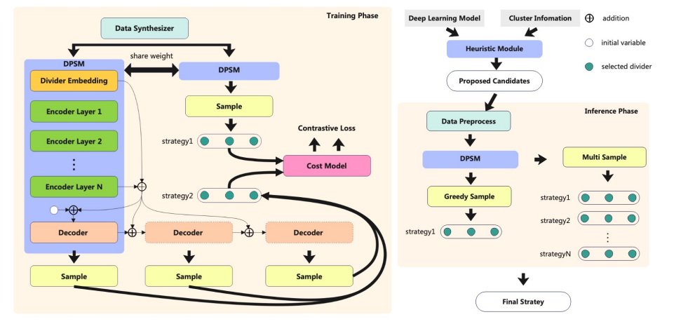

# APSS(for Training): Automatically Distributed Deep Learning Parallelism Strategies Search by Self Play

APSS 是一种基于神经网络和启发式策略的深度学习模型分布式训练切分(3D parallelism)快速策略搜索算法，它结合启发式策略和训练集群环境初步生成候选策略，然后通过深度管道策略网络（DPSN）为每个候选策略提供详细的pipeline划分，采用自我对弈的对比强化学习（CRLSP）进行离线训练，无需实际数据收集和后续应用中的微调。此仓库我们使用[Mindspore](https://www.mindspore.cn/)进行实现。

----------

## Context
- [Installation](#installation)
- [Usage and Examples](#usage-and-examples)
  - [生成PP问题的验证数据集](#生成PP问题的验证数据集)
  - [执行训练](#执行训练)
- [How It Works](#how-it-works)


## Installation
Requirements:  
 - Python >= 3.7
 - Mindspore >= 2.2.0

**以下安装方式在后续版本已经弃用，要构建环境请参考[training_guides](docs/training_guides.md)**
### ~~Method 1: With pip~~
```
pip install apss
```

### ~~Method 2: From source~~
```
git clone https://github.com/Cheny1m/APSS
cd APSS
pip install -e .
```

## Usage and Examples

### 一步执行训练

```
python -m apss.training.apss_run --graph_size 30 --num_split 15 --model attention_v2 --rebuild_data
```
* `graph_size` , `num_split` 分别代表了问题的层数大小和需要执行pipeline划分的数量，两个命令行参数共同描述了所训练问题的大小，可根据需求动态调整。
* `model`参数表示模型选择器，默认为`attention`,还有`attention_v2`（可选）
* `rebuild_data` 表示是否在执行训练前，从Data Synthesizer中生成训练数据，默认建议开启。如果需要从`.ckpt`中接续训练或无需改变之前生成的训练数据直接禁用`--rebuild_data`参数即可。训练数据可在/data目录下找到。
* 已经完成过执行训练后，`.ckpt`保存在/output文件夹下，日志保存在/log文件夹下，可以通过tensorboard_logger在浏览器中实时查看训练过程及其数据。

### 一步执行推理
```
python -m apss.inference.run_inference (-n 1 -m 1 --hidden_size 1024 --sequence_length 1024 --num_layers 24 --vocab_size 52256 --type "gpt2")
```
* `-n`，`-m`指的是节点数与每个节点的卡数。
* `--type`指的是模型名称
* 其他参数均为model的参数，请保持与mindformers中的参数一致

* 推理过程执行完成后，在apss_main_logs中可以看到对应的分布式并行策略。其中rank_0即为最优策略。mp_deg值对应model_parallel，dp_deg对应data_parallel，pp_deg对应pipeline_parallel，而0开头，num_layers数值结尾的list则是pipeline_stage的划分。


## How It Works
 


## Contributors

<a href="https://github.com/your-repository/graphs/contributors">
  
</a>
