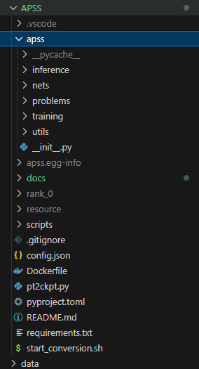
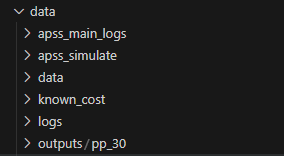
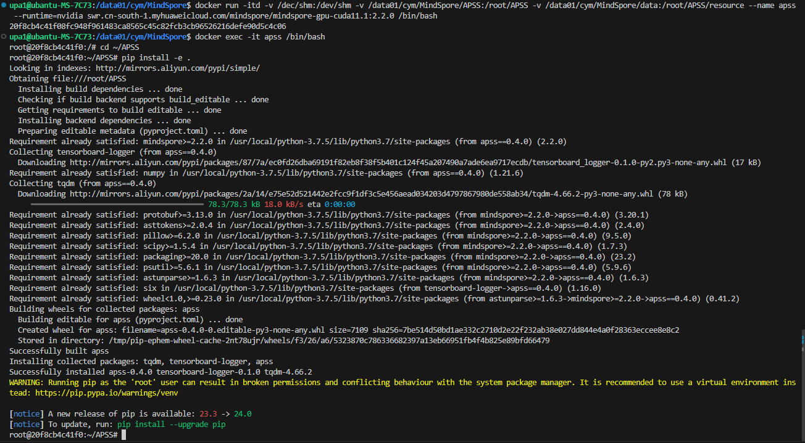
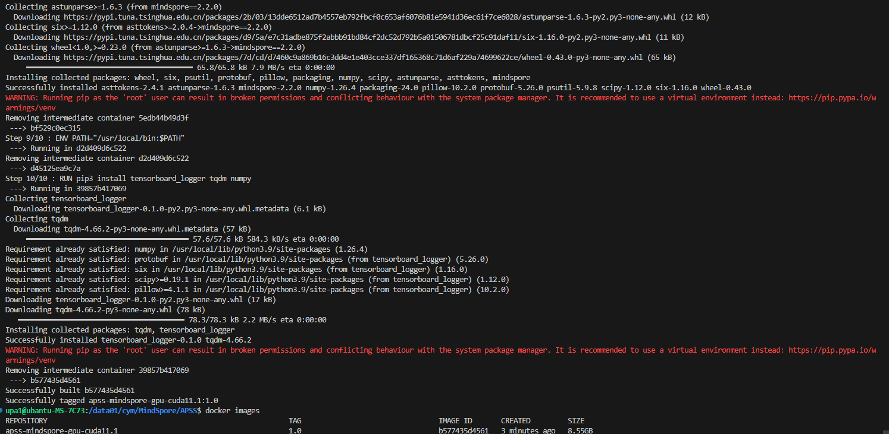
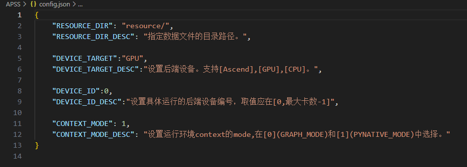
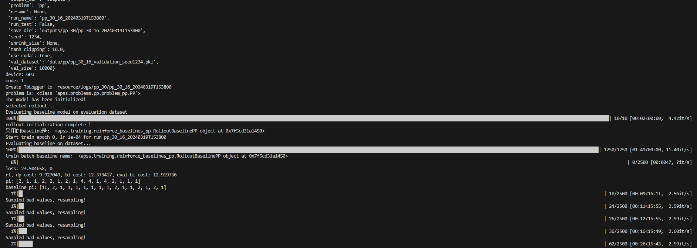
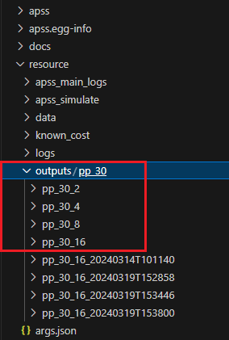

# APSS Training Guide  【APSS训练指南】
### [2024.03.20] 
本指南指导用户如何构建APSS并行搜索策略项目的训练过程。

本项目训练过程支持的后端设备为：
  * Ascend[(Help)](https://www.hiascend.com/)
  * GPU
  * CPU

本指导文件以GPU环境和Ascend环境为例，所有代码在`Python = 3.7; Mindspore = 2.2.0`的`Nvidia GPU V100`和`Ascend NPU 910B`上通过测试。其中Ascend环境以`90.90.93.240`上的环境和代码为例。

## 目录
- [1. 项目清单](#1-项目清单)
- [2. 环境构建](#环境构建)
  - [GPU](#21-gpu)
    - [Method 1: 使用Mindspore官方镜像并从源码构建](#method-1-使用mindspore官方镜像并从源码构建)
    - [Method 2: 用我们已经构建好的镜像](#method-2-使用我们已经构建好的镜像)
  - [Ascend](#22-ascend)
- [程序运行](#程序运行)
- [训练原理](#训练原理)

## 1. 项目清单
  * 代码包APSS (APSS.zip)
    - apss为项目源代码部分，inference表示推理部分代码，nets表示模型，problems表示我们抽象出来的拟训练问题，training表示训练部分代码，utils是一些工具类。
    - checkpoint是我们预训练好的一些Mindspore权重。
    - apss.egg-info为打包后测试使用pip安装apss包后的元数据信息，用户无需关心。
    - docs是一些说明文档，包括项目训练说明以及一些常见的问题。
    - resource是外部数据包`/..data`默认链接目录，主要包括日志、输出文件以及训练产生的ckpt，可由用户在`config.json`中配置。
    -	scripts包含一些自动化处理的脚本。
    -	config.json包含一些全局的配置，主要包括数据包目录配置、训练图启动模式，后端设备选择以及ID设置。
    - dockerfile为`GPU`训练环境镜像构建文件。
    -	pyproject.toml为配置依赖启动文件。

    

  * 数据包data(APSS-graphmode.zip中与APSS同级)

    

    - 单独开辟了占用空间较大的数据存储，并在构建程序运行环境时，分别将源代码文件和数据包内容同时映射或放入运行环境中，数据包由代码文件APSS中的/resource目录进行映射。即APSS/resource -->data，无需用户感知。

  * GPU环境的Docker镜像 (https://hub.docker.com/repository/docker/cheny1m/apss-mindspore-gpu-cuda11.1/general)
    - 使用Mindspore官方镜像后，使用pip进行源码安装。
    - 使用[dockerfile](/dockerfile)构建我们已经打包好的容器或者从docker hub上拉取。

  * Mindspore在Ascend环境下暂未使用Docker[(Mindspore官方安装界面)]((https://www.mindspore.cn/install))，且所有训练测试均在杭研所`90.90.93.240`和`90.90.93.242`服务器既定的`Mindspore=2.2.0`环境下完成，所以本项目不包含Ascend环境下的Docker。仅能通过源码安装。

## 2. 环境构建
Requirements:  
 - Python >= 3.7
 - Mindspore >= 2.2.0 [(Help)](https://www.mindspore.cn/install)

## 2.1. GPU
### Method 1: 使用Mindspore官方镜像并从源码构建
启动容器：将`源代码目录APSS`（本例中为/data01/cym/MindSpore/APSS）和`数据包目录data`（本例中为/data01/cym/MindSpore/data）分别映射到容器内部的`APSS`目录（本例中为/root/APSS）和`APSS/resource`目录（本例中为/root/APSS/resource）
***注意：如果数据包的容器映射目录不为默认的`resource`，请在[config.json](/config.json)中修改`RESOURCE_DIR`的value为您定义的目录。***
```bash
docker run -itd -v /dec/shm:/dev/shm -v /data01/cym/MindSpore/APSS:/root/APSS -v /data01/cym/MindSpore/data:/root/APSS/resource --name apss --runtime=nvidia swr.cn-south-1.myhuaweicloud.com/mindspore/mindspore-gpu-cuda11.1:2.2.0 /bin/bash

docker exec -it apss /bin/bash
```
从源码构建：
```bash
cd ~/APSS
pip install -e .
```



### Method 2: 使用我们已经构建好的镜像
[可选1]拉取镜像
```bash
docker push cheny1m/apss-mindspore-gpu-cuda11.1:1.0
```
[可选2]或者通过dockerfile构建镜像
```bash
cd APSS
docker build -t apss-mindspore-gpu-cuda11.1:1.0 .
```

  

获得镜像后,启动容器（代码映射解释见[方法1 启动容器](#method-1-使用mindspore官方镜像并从源码构建))：如采用通过dockerfile构建镜像，请将下述命令中的`cheny1m/apss-mindspore-gpu-cuda11.1:1.0`替换为`apss-mindspore-gpu-cuda11.1:1.0`
```bash
docker run -itd -v /dev/shm:/dev/shm -v /home/upa1/cym/MindSpore/APSS:/root/APSS -v /home/upa1/cym/MindSpore/data:/root/APSS/resource --name apss --runtime=nvidia cheny1m/apss-mindspore-gpu-cuda11.1:1.0 /bin/bash

docker exec -it apss /bin/bash
cd ~/APSS
```

## 2.2 Ascend 
进入已有的Mindspore环境后从源码构建即可：
```bash
# from 90.90.93.240
cd /home/xby
source xby_env.sh r2_3

cd ~/APSS
pip install -e .
```

## 3. 程序运行
### 3.1 设置运行环境的context
本步骤主要设置运行时的目标设备和模式，默认目标设备为`Ascend`，默认运行模式为`PYNATIVE_MODE`。如需查看详情和修改目标设备及运行模式，请在[config.json](/config.json)中修改。
* "DEVICE_TARGET": 设置运行设备。支持[Ascend],[GPU],[CPU].

* "CONTEXT_MODE": 设置运行环境context的mode,在[0]：(GRAPH_MODE)和[1]：(PYNATIVE_MODE)中选择。

  


### 3.2 一步执行训练

```
python -m apss.training.apss_run --graph_size 30 --num_split 15 --model attention_v2 --rebuild_data
```
* `graph_size` , `num_split` 分别代表了问题的层数大小和需要执行pipeline划分的数量，两个命令行参数共同描述了所训练问题的大小，可根据需求动态调整。目前graph_size取值范围为`[8,18,25,30,42,54,102]`, num_split取值范围为`[1,3,7,15,31,63]`。
* `model`参数表示模型选择器，默认为`attention`,还有`attention_v2`（可选）
* `rebuild_data` 表示是否在执行训练前，从Data Synthesizer中生成训练数据，默认建议开启。如果需要从`.ckpt`中接续训练或无需改变之前生成的训练数据直接禁用`--rebuild_data`参数即可。生成的训练数据可在数据包data即`/resource`映射目录下找到。

  

执行上述代码会执行apss的训练。每个模型训练默认训练100个epoch，每个epoch训练1,280,000条数据，batch_size为512。如需微调这些超参，请在[options.py](../apss/training/options.py)中调整。

### 3.3 模型参数保存
* 执行训练后，本次运行的参数文件及`.ckpt`文件将保存在数据包的/output文件夹下，日志保存在数据包的/log文件夹下，可以通过tensorboard_logger在浏览器中实时查看训练过程及其数据。
* 当前已经训练好的可用于推理的权重保存在`resource/outputs/pp_30`下不带时间戳的文件夹中。

  

## 训练原理
 
