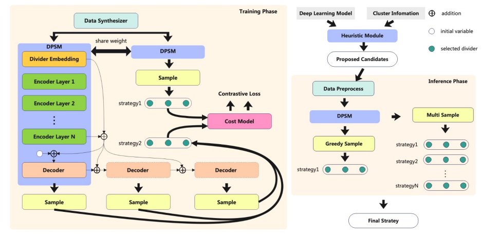

# APSS Training Guide
指导用户如何构建APSS项目的训练过程。

## 目录
- [项目清单](#项目清单)
- [环境构建](#环境构建)
  - [Method 1: With Mindspore's Official Image and Build from Source](#Method 1: With Mindspore's Official Image and Build from Source)
  - [Method 2: With Our Docker Image](#Method 2: With Our Docker Image)
- [程序运行](#程序运行)
- [训练原理](#训练原理)

## 项目清单
  * 源代码 (https://github.com/Cheny1m/APSS)
  * 数据包 
  * Docker环境镜像 (https://hub.docker.com/repository/docker/cheny1m/apss-mindspore-gpu-cuda11.1/general)

## 环境构建
Requirements:  
 - Python >= 3.7
 - Mindspore >= 2.1.1 [(Help)](https://www.mindspore.cn/install)

### Method 1: With Mindspore's Official Image and Build from Source
启动容器：将`源代码目录APSS`（本例中为/home/upa1/cym/MindSpore/APSS）和`数据包目录data`（本例中为/home/upa1/cym/MindSpore/data）分别映射到容器内部的`APSS`目录（本例中为/root/APSS）和`APSS/resource`目录（本例中为/root/APSS/resource）。
```
docker run -itd -v /dec/shm:/dev/shm -v /home/upa1/cym/MindSpore/APSS:/root/APSS -v /home/upa1/cym/MindSpore/data:/root/APSS/resource --name apss --runtime=nvidia swr.cn-south-1.myhuaweicloud.com/mindspore/mindspore-gpu-cuda11.1:2.2.0 /bin/bash

docker exec -it apss /bin/bash
```
从源码构建：
```
cd ~/APSS
pip install -e .
```

### Method 2: With Our Docker Image
拉取并启动容器：
```
docker push cheny1m/apss-mindspore-gpu-cuda11.1:1.0

docker run -itd -v /dec/shm:/dev/shm -v /home/upa1/cym/MindSpore/APSS:/root/APSS -v /home/upa1/cym/MindSpore/data:/root/APSS/resource --name apss --runtime=nvidia cheny1m/apss-mindspore-gpu-cuda11.1:1.0 /bin/bash

docker exec -it apss /bin/bash
cd ~/APSS
```

## 程序运行
### 一步执行训练

```
python -m apss.training.apss_run --graph_size 8 --num_split 3 --rebuild_data
```
* `graph_size` , `num_split` 分别代表了问题的层数大小和需要执行pipeline划分的数量，两个命令行参数共同描述了所训练问题的大小，可根据需求动态调整。目前graph_size取值范围为`[8,18,25,30,42,54,102]`, num_split取值范围为`[1,3,7,15,31,63]`。
* `rebuild_data` 表示是否在执行训练前，从Data Synthesizer中生成训练数据，默认建议开启。如果需要从`.ckpt`中接续训练或无需改变之前生成的训练数据直接禁用`--rebuild_data`参数即可。生成的训练数据可在数据包的/data目录下找到。
* 已经完成过执行训练后，本次运行的参数文件及`.ckpt`文件将保存在数据包的/output文件夹下，日志保存在数据包的/log文件夹下，可以通过tensorboard_logger在浏览器中实时查看训练过程及其数据。

执行上述代码会执行apss的训练，所有在num_split取值范围中且小于设定的num_split的模型都将被训练。每个模型训练默认训练100个epoch，每个epoch训练1,280,000条数据，batch_size为512。

## 训练原理
